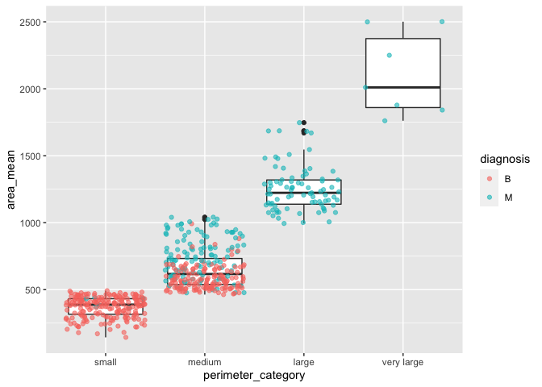
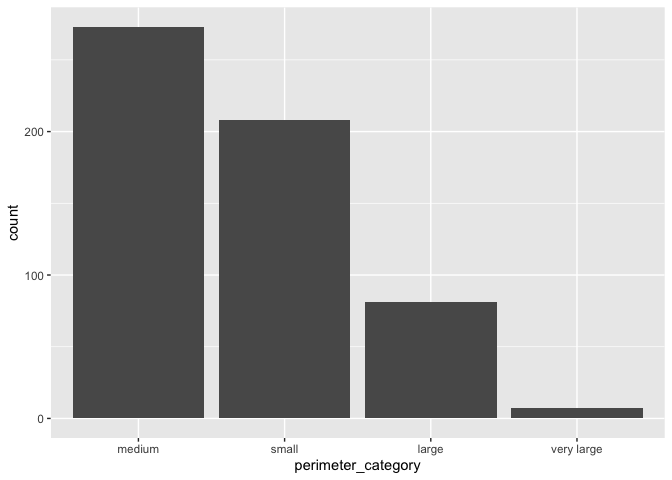
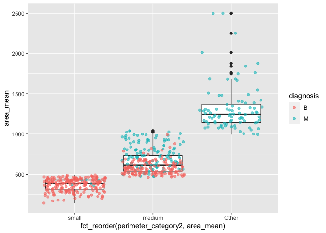
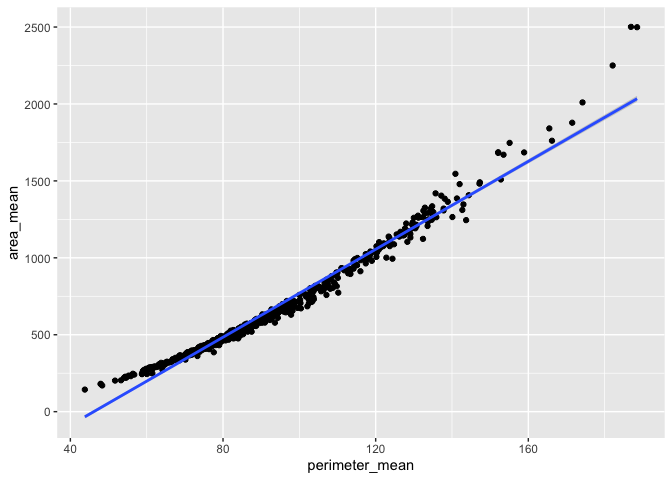

Mini data analysis 2
================
Maithili Devadas
2022-10-26

*To complete this milestone, you can edit [this `.rmd`
file](https://raw.githubusercontent.com/UBC-STAT/stat545.stat.ubc.ca/master/content/mini-project/mini-project-2.Rmd)
directly. Fill in the sections that are commented out with
`<!--- start your work here--->`. When you are done, make sure to knit
to an `.md` file by changing the output in the YAML header to
`github_document`, before submitting a tagged release on canvas.*

# Welcome to your second (and last) milestone in your mini data analysis project!

In Milestone 1, you explored your data, came up with research questions,
and obtained some results by making summary tables and graphs. This
time, we will first explore more in depth the concept of *tidy data.*
Then, you’ll be sharpening some of the results you obtained from your
previous milestone by:

-   Manipulating special data types in R: factors and/or dates and
    times.
-   Fitting a model object to your data, and extract a result.
-   Reading and writing data as separate files.

**NOTE**: The main purpose of the mini data analysis is to integrate
what you learn in class in an analysis. Although each milestone provides
a framework for you to conduct your analysis, it’s possible that you
might find the instructions too rigid for your data set. If this is the
case, you may deviate from the instructions – just make sure you’re
demonstrating a wide range of tools and techniques taught in this class.

# Instructions

**To complete this milestone**, edit [this very `.Rmd`
file](https://raw.githubusercontent.com/UBC-STAT/stat545.stat.ubc.ca/master/content/mini-project/mini-project-2.Rmd)
directly. Fill in the sections that are tagged with
`<!--- start your work here--->`.

**To submit this milestone**, make sure to knit this `.Rmd` file to an
`.md` file by changing the YAML output settings from
`output: html_document` to `output: github_document`. Commit and push
all of your work to your mini-analysis GitHub repository, and tag a
release on GitHub. Then, submit a link to your tagged release on canvas.

**Points**: This milestone is worth 55 points (compared to the 45 points
of the Milestone 1): 45 for your analysis, and 10 for your entire
mini-analysis GitHub repository. Details follow.

**Research Questions**: In Milestone 1, you chose two research questions
to focus on. Wherever realistic, your work in this milestone should
relate to these research questions whenever we ask for justification
behind your work. In the case that some tasks in this milestone don’t
align well with one of your research questions, feel free to discuss
your results in the context of a different research question.

# Learning Objectives

By the end of this milestone, you should:

-   Understand what *tidy* data is, and how to create it using `tidyr`.
-   Generate a reproducible and clear report using R Markdown.
-   Manipulating special data types in R: factors and/or dates and
    times.
-   Fitting a model object to your data, and extract a result.
-   Reading and writing data as separate files.

# Setup

Begin by loading your data and the tidyverse package below:

``` r
library(datateachr) # <- might contain the data you picked!
library(tidyverse)
```

# Task 1: Tidy your data (15 points)

In this task, we will do several exercises to reshape our data. The goal
here is to understand how to do this reshaping with the `tidyr` package.

A reminder of the definition of *tidy* data:

-   Each row is an **observation**
-   Each column is a **variable**
-   Each cell is a **value**

*Tidy’ing* data is sometimes necessary because it can simplify
computation. Other times it can be nice to organize data so that it can
be easier to understand when read manually.

### 2.1 (2.5 points)

Based on the definition above, can you identify if your data is tidy or
untidy? Go through all your columns, or if you have \>8 variables, just
pick 8, and explain whether the data is untidy or tidy.

<!--------------------------- Start your work below --------------------------->

``` r
#Loading my dataset
cancer_sample
```

    ## # A tibble: 569 × 32
    ##          ID diagnosis radius_m…¹ textu…² perim…³ area_…⁴ smoot…⁵ compa…⁶ conca…⁷
    ##       <dbl> <chr>          <dbl>   <dbl>   <dbl>   <dbl>   <dbl>   <dbl>   <dbl>
    ##  1   842302 M               18.0    10.4   123.    1001   0.118   0.278   0.300 
    ##  2   842517 M               20.6    17.8   133.    1326   0.0847  0.0786  0.0869
    ##  3 84300903 M               19.7    21.2   130     1203   0.110   0.160   0.197 
    ##  4 84348301 M               11.4    20.4    77.6    386.  0.142   0.284   0.241 
    ##  5 84358402 M               20.3    14.3   135.    1297   0.100   0.133   0.198 
    ##  6   843786 M               12.4    15.7    82.6    477.  0.128   0.17    0.158 
    ##  7   844359 M               18.2    20.0   120.    1040   0.0946  0.109   0.113 
    ##  8 84458202 M               13.7    20.8    90.2    578.  0.119   0.164   0.0937
    ##  9   844981 M               13      21.8    87.5    520.  0.127   0.193   0.186 
    ## 10 84501001 M               12.5    24.0    84.0    476.  0.119   0.240   0.227 
    ## # … with 559 more rows, 23 more variables: concave_points_mean <dbl>,
    ## #   symmetry_mean <dbl>, fractal_dimension_mean <dbl>, radius_se <dbl>,
    ## #   texture_se <dbl>, perimeter_se <dbl>, area_se <dbl>, smoothness_se <dbl>,
    ## #   compactness_se <dbl>, concavity_se <dbl>, concave_points_se <dbl>,
    ## #   symmetry_se <dbl>, fractal_dimension_se <dbl>, radius_worst <dbl>,
    ## #   texture_worst <dbl>, perimeter_worst <dbl>, area_worst <dbl>,
    ## #   smoothness_worst <dbl>, compactness_worst <dbl>, concavity_worst <dbl>, …

``` r
#Choosing 8 variables as instructed 
Eightvariables_cancersample <- cancer_sample %>% select(ID,diagnosis, radius_mean, texture_mean, perimeter_mean, area_mean, smoothness_mean, compactness_mean)
Eightvariables_cancersample
```

    ## # A tibble: 569 × 8
    ##          ID diagnosis radius_mean texture_mean perimet…¹ area_…² smoot…³ compa…⁴
    ##       <dbl> <chr>           <dbl>        <dbl>     <dbl>   <dbl>   <dbl>   <dbl>
    ##  1   842302 M                18.0         10.4     123.    1001   0.118   0.278 
    ##  2   842517 M                20.6         17.8     133.    1326   0.0847  0.0786
    ##  3 84300903 M                19.7         21.2     130     1203   0.110   0.160 
    ##  4 84348301 M                11.4         20.4      77.6    386.  0.142   0.284 
    ##  5 84358402 M                20.3         14.3     135.    1297   0.100   0.133 
    ##  6   843786 M                12.4         15.7      82.6    477.  0.128   0.17  
    ##  7   844359 M                18.2         20.0     120.    1040   0.0946  0.109 
    ##  8 84458202 M                13.7         20.8      90.2    578.  0.119   0.164 
    ##  9   844981 M                13           21.8      87.5    520.  0.127   0.193 
    ## 10 84501001 M                12.5         24.0      84.0    476.  0.119   0.240 
    ## # … with 559 more rows, and abbreviated variable names ¹​perimeter_mean,
    ## #   ²​area_mean, ³​smoothness_mean, ⁴​compactness_mean

**The tidy-ness of the dataset is determined by the type of analysis one
has to conduct. If the structure of the dataset is conducive to
answering the research questions, we can call the dataset tidy. From the
given definition, and data requirement for analysis, the above dataset
is tidy. Each observation is a row. Each row has a unique ID that
corresponds to an observation. Each column is a variable that represents
the characteristics of a cancer cell. Each value is a reflection of the
observation’s cancer cell’s characteristics. For example, Row 1 ID =
842302 is an observation, 17.99 (value) is the radius_mean(variable).
This dataset is tidy because it is also easier to plot relationships for
the given structure.**

<!----------------------------------------------------------------------------->

### 2.2 (5 points)

Now, if your data is tidy, untidy it! Then, tidy it back to it’s
original state.

If your data is untidy, then tidy it! Then, untidy it back to it’s
original state.

Be sure to explain your reasoning for this task. Show us the “before”
and “after”.

<!--------------------------- Start your work below --------------------------->

``` r
#Before: Using 'pivot_wider, we create more columns in our dataset. The type of diagnosis ie. M(Malignant) and B(Benign) are now columns, and the values of 'radius_mean' are represented below these columns. This arrangement has also given rise to a large number of 'NAs'. Additionally, since the variable of primary interest is the type of diagnosis, having the same in under one column would be easier to view and also analyse relationships between diagnosis and other variables.

untidydata <- cancer_sample %>%
    pivot_wider(names_from = diagnosis,
                values_from = radius_mean)
print(untidydata)
```

    ## # A tibble: 569 × 32
    ##          ID texture_mean perim…¹ area_…² smoot…³ compa…⁴ conca…⁵ conca…⁶ symme…⁷
    ##       <dbl>        <dbl>   <dbl>   <dbl>   <dbl>   <dbl>   <dbl>   <dbl>   <dbl>
    ##  1   842302         10.4   123.    1001   0.118   0.278   0.300   0.147    0.242
    ##  2   842517         17.8   133.    1326   0.0847  0.0786  0.0869  0.0702   0.181
    ##  3 84300903         21.2   130     1203   0.110   0.160   0.197   0.128    0.207
    ##  4 84348301         20.4    77.6    386.  0.142   0.284   0.241   0.105    0.260
    ##  5 84358402         14.3   135.    1297   0.100   0.133   0.198   0.104    0.181
    ##  6   843786         15.7    82.6    477.  0.128   0.17    0.158   0.0809   0.209
    ##  7   844359         20.0   120.    1040   0.0946  0.109   0.113   0.074    0.179
    ##  8 84458202         20.8    90.2    578.  0.119   0.164   0.0937  0.0598   0.220
    ##  9   844981         21.8    87.5    520.  0.127   0.193   0.186   0.0935   0.235
    ## 10 84501001         24.0    84.0    476.  0.119   0.240   0.227   0.0854   0.203
    ## # … with 559 more rows, 23 more variables: fractal_dimension_mean <dbl>,
    ## #   radius_se <dbl>, texture_se <dbl>, perimeter_se <dbl>, area_se <dbl>,
    ## #   smoothness_se <dbl>, compactness_se <dbl>, concavity_se <dbl>,
    ## #   concave_points_se <dbl>, symmetry_se <dbl>, fractal_dimension_se <dbl>,
    ## #   radius_worst <dbl>, texture_worst <dbl>, perimeter_worst <dbl>,
    ## #   area_worst <dbl>, smoothness_worst <dbl>, compactness_worst <dbl>,
    ## #   concavity_worst <dbl>, concave_points_worst <dbl>, symmetry_worst <dbl>, …

``` r
#After: The variables of primary interest are in a column (diagnosis). This makes it easier to view the dataset and also visualize relationships between diagnosis and other variables of interest. The 'pivot_longer' command is used to create more rows.

tidydata <- untidydata %>% 
  pivot_longer(cols = c('M', 'B'), 
               names_to  = "diagnosis", 
               values_to = "radius_mean", values_drop_na = TRUE)
print(tidydata)
```

    ## # A tibble: 569 × 32
    ##          ID texture_mean perim…¹ area_…² smoot…³ compa…⁴ conca…⁵ conca…⁶ symme…⁷
    ##       <dbl>        <dbl>   <dbl>   <dbl>   <dbl>   <dbl>   <dbl>   <dbl>   <dbl>
    ##  1   842302         10.4   123.    1001   0.118   0.278   0.300   0.147    0.242
    ##  2   842517         17.8   133.    1326   0.0847  0.0786  0.0869  0.0702   0.181
    ##  3 84300903         21.2   130     1203   0.110   0.160   0.197   0.128    0.207
    ##  4 84348301         20.4    77.6    386.  0.142   0.284   0.241   0.105    0.260
    ##  5 84358402         14.3   135.    1297   0.100   0.133   0.198   0.104    0.181
    ##  6   843786         15.7    82.6    477.  0.128   0.17    0.158   0.0809   0.209
    ##  7   844359         20.0   120.    1040   0.0946  0.109   0.113   0.074    0.179
    ##  8 84458202         20.8    90.2    578.  0.119   0.164   0.0937  0.0598   0.220
    ##  9   844981         21.8    87.5    520.  0.127   0.193   0.186   0.0935   0.235
    ## 10 84501001         24.0    84.0    476.  0.119   0.240   0.227   0.0854   0.203
    ## # … with 559 more rows, 23 more variables: fractal_dimension_mean <dbl>,
    ## #   radius_se <dbl>, texture_se <dbl>, perimeter_se <dbl>, area_se <dbl>,
    ## #   smoothness_se <dbl>, compactness_se <dbl>, concavity_se <dbl>,
    ## #   concave_points_se <dbl>, symmetry_se <dbl>, fractal_dimension_se <dbl>,
    ## #   radius_worst <dbl>, texture_worst <dbl>, perimeter_worst <dbl>,
    ## #   area_worst <dbl>, smoothness_worst <dbl>, compactness_worst <dbl>,
    ## #   concavity_worst <dbl>, concave_points_worst <dbl>, symmetry_worst <dbl>, …

``` r
#Re-ordering the columns as the original dataset.
select(tidydata,ID,diagnosis,radius_mean,everything())
```

    ## # A tibble: 569 × 32
    ##          ID diagnosis radius_m…¹ textu…² perim…³ area_…⁴ smoot…⁵ compa…⁶ conca…⁷
    ##       <dbl> <chr>          <dbl>   <dbl>   <dbl>   <dbl>   <dbl>   <dbl>   <dbl>
    ##  1   842302 M               18.0    10.4   123.    1001   0.118   0.278   0.300 
    ##  2   842517 M               20.6    17.8   133.    1326   0.0847  0.0786  0.0869
    ##  3 84300903 M               19.7    21.2   130     1203   0.110   0.160   0.197 
    ##  4 84348301 M               11.4    20.4    77.6    386.  0.142   0.284   0.241 
    ##  5 84358402 M               20.3    14.3   135.    1297   0.100   0.133   0.198 
    ##  6   843786 M               12.4    15.7    82.6    477.  0.128   0.17    0.158 
    ##  7   844359 M               18.2    20.0   120.    1040   0.0946  0.109   0.113 
    ##  8 84458202 M               13.7    20.8    90.2    578.  0.119   0.164   0.0937
    ##  9   844981 M               13      21.8    87.5    520.  0.127   0.193   0.186 
    ## 10 84501001 M               12.5    24.0    84.0    476.  0.119   0.240   0.227 
    ## # … with 559 more rows, 23 more variables: concave_points_mean <dbl>,
    ## #   symmetry_mean <dbl>, fractal_dimension_mean <dbl>, radius_se <dbl>,
    ## #   texture_se <dbl>, perimeter_se <dbl>, area_se <dbl>, smoothness_se <dbl>,
    ## #   compactness_se <dbl>, concavity_se <dbl>, concave_points_se <dbl>,
    ## #   symmetry_se <dbl>, fractal_dimension_se <dbl>, radius_worst <dbl>,
    ## #   texture_worst <dbl>, perimeter_worst <dbl>, area_worst <dbl>,
    ## #   smoothness_worst <dbl>, compactness_worst <dbl>, concavity_worst <dbl>, …

<!----------------------------------------------------------------------------->

### 2.3 (7.5 points)

Now, you should be more familiar with your data, and also have made
progress in answering your research questions. Based on your interest,
and your analyses, pick 2 of the 4 research questions to continue your
analysis in the next four tasks:

<!-------------------------- Start your work below ---------------------------->

**1.Is there a significant relationship between the perimeter of the
nucleus and the type of diagnosis i.e. malignant or benign?** **2.Is
there a significant relationship between the area and the type of
diagnosis?**

**Additional question used for carrying out Task 2** **3. What is the
relationship between area_mean and perimeter_mean?**

<!----------------------------------------------------------------------------->

Explain your decision for choosing the above two research questions.

<!--------------------------- Start your work below --------------------------->

**From the first milestone, with the boxplot visualisations, it was
clear that there was a difference in mean_perimeter and mean_area for
the different types of diagnosis. From the visualisations, it was clear
that the mean_perimeter and mean_area was higher for malignant diagnosis
as compared to benign diagnosis. It would be interesting to understand
whether this difference is significant and whether these characteristics
of the cancer cell can determine the type of diagnosis. Additionally, it
would be interesting to understand the relationship between perimeter
and area.**
<!----------------------------------------------------------------------------->

Now, try to choose a version of your data that you think will be
appropriate to answer these 2 questions. Use between 4 and 8 functions
that we’ve covered so far (i.e. by filtering, cleaning, tidy’ing,
dropping irrelevant columns, etc.).

<!--------------------------- Start your work below --------------------------->

``` r
#To answer the research questions posed, variables diagnosis, perimeter_mean and area_mean are required. These can be isolated from the original dataset by using the 'select' command. 
select(cancer_sample,diagnosis,perimeter_mean,area_mean)
```

    ## # A tibble: 569 × 3
    ##    diagnosis perimeter_mean area_mean
    ##    <chr>              <dbl>     <dbl>
    ##  1 M                  123.      1001 
    ##  2 M                  133.      1326 
    ##  3 M                  130       1203 
    ##  4 M                   77.6      386.
    ##  5 M                  135.      1297 
    ##  6 M                   82.6      477.
    ##  7 M                  120.      1040 
    ##  8 M                   90.2      578.
    ##  9 M                   87.5      520.
    ## 10 M                   84.0      476.
    ## # … with 559 more rows

``` r
#We could also use the filter command and select only one kind of diagnosis to perform different tests. 
cancer_sample %>%
 filter(diagnosis == "M")  
```

    ## # A tibble: 212 × 32
    ##          ID diagnosis radius_m…¹ textu…² perim…³ area_…⁴ smoot…⁵ compa…⁶ conca…⁷
    ##       <dbl> <chr>          <dbl>   <dbl>   <dbl>   <dbl>   <dbl>   <dbl>   <dbl>
    ##  1   842302 M               18.0    10.4   123.    1001   0.118   0.278   0.300 
    ##  2   842517 M               20.6    17.8   133.    1326   0.0847  0.0786  0.0869
    ##  3 84300903 M               19.7    21.2   130     1203   0.110   0.160   0.197 
    ##  4 84348301 M               11.4    20.4    77.6    386.  0.142   0.284   0.241 
    ##  5 84358402 M               20.3    14.3   135.    1297   0.100   0.133   0.198 
    ##  6   843786 M               12.4    15.7    82.6    477.  0.128   0.17    0.158 
    ##  7   844359 M               18.2    20.0   120.    1040   0.0946  0.109   0.113 
    ##  8 84458202 M               13.7    20.8    90.2    578.  0.119   0.164   0.0937
    ##  9   844981 M               13      21.8    87.5    520.  0.127   0.193   0.186 
    ## 10 84501001 M               12.5    24.0    84.0    476.  0.119   0.240   0.227 
    ## # … with 202 more rows, 23 more variables: concave_points_mean <dbl>,
    ## #   symmetry_mean <dbl>, fractal_dimension_mean <dbl>, radius_se <dbl>,
    ## #   texture_se <dbl>, perimeter_se <dbl>, area_se <dbl>, smoothness_se <dbl>,
    ## #   compactness_se <dbl>, concavity_se <dbl>, concave_points_se <dbl>,
    ## #   symmetry_se <dbl>, fractal_dimension_se <dbl>, radius_worst <dbl>,
    ## #   texture_worst <dbl>, perimeter_worst <dbl>, area_worst <dbl>,
    ## #   smoothness_worst <dbl>, compactness_worst <dbl>, concavity_worst <dbl>, …

``` r
cancer_sample %>%
 filter(diagnosis == "B") 
```

    ## # A tibble: 357 × 32
    ##          ID diagnosis radius_m…¹ textu…² perim…³ area_…⁴ smoot…⁵ compa…⁶ conca…⁷
    ##       <dbl> <chr>          <dbl>   <dbl>   <dbl>   <dbl>   <dbl>   <dbl>   <dbl>
    ##  1  8510426 B              13.5     14.4    87.5    566.  0.0978  0.0813  0.0666
    ##  2  8510653 B              13.1     15.7    85.6    520   0.108   0.127   0.0457
    ##  3  8510824 B               9.50    12.4    60.3    274.  0.102   0.0649  0.0296
    ##  4   854941 B              13.0     18.4    82.6    524.  0.0898  0.0377  0.0256
    ##  5 85713702 B               8.20    16.8    51.7    202.  0.086   0.0594  0.0159
    ##  6   857155 B              12.0     14.6    78.0    449.  0.103   0.0909  0.0659
    ##  7   857156 B              13.5     22.3    86.9    561   0.0875  0.0770  0.0475
    ##  8   857343 B              11.8     21.6    74.7    428.  0.0864  0.0497  0.0166
    ##  9   857373 B              13.6     16.3    87.2    572.  0.0768  0.0606  0.0186
    ## 10   857374 B              11.9     18.2    75.7    438.  0.0826  0.0475  0.0197
    ## # … with 347 more rows, 23 more variables: concave_points_mean <dbl>,
    ## #   symmetry_mean <dbl>, fractal_dimension_mean <dbl>, radius_se <dbl>,
    ## #   texture_se <dbl>, perimeter_se <dbl>, area_se <dbl>, smoothness_se <dbl>,
    ## #   compactness_se <dbl>, concavity_se <dbl>, concave_points_se <dbl>,
    ## #   symmetry_se <dbl>, fractal_dimension_se <dbl>, radius_worst <dbl>,
    ## #   texture_worst <dbl>, perimeter_worst <dbl>, area_worst <dbl>,
    ## #   smoothness_worst <dbl>, compactness_worst <dbl>, concavity_worst <dbl>, …

``` r
#We could also use the filter command to define the perimeter and area values to understand the type of diagnosis that range constitutes.   
cancer_sample %>%
 filter(perimeter_mean>78, area_mean>400)  
```

    ## # A tibble: 390 × 32
    ##          ID diagnosis radius_m…¹ textu…² perim…³ area_…⁴ smoot…⁵ compa…⁶ conca…⁷
    ##       <dbl> <chr>          <dbl>   <dbl>   <dbl>   <dbl>   <dbl>   <dbl>   <dbl>
    ##  1   842302 M               18.0    10.4   123.    1001   0.118   0.278   0.300 
    ##  2   842517 M               20.6    17.8   133.    1326   0.0847  0.0786  0.0869
    ##  3 84300903 M               19.7    21.2   130     1203   0.110   0.160   0.197 
    ##  4 84358402 M               20.3    14.3   135.    1297   0.100   0.133   0.198 
    ##  5   843786 M               12.4    15.7    82.6    477.  0.128   0.17    0.158 
    ##  6   844359 M               18.2    20.0   120.    1040   0.0946  0.109   0.113 
    ##  7 84458202 M               13.7    20.8    90.2    578.  0.119   0.164   0.0937
    ##  8   844981 M               13      21.8    87.5    520.  0.127   0.193   0.186 
    ##  9 84501001 M               12.5    24.0    84.0    476.  0.119   0.240   0.227 
    ## 10   845636 M               16.0    23.2   103.     798.  0.0821  0.0667  0.0330
    ## # … with 380 more rows, 23 more variables: concave_points_mean <dbl>,
    ## #   symmetry_mean <dbl>, fractal_dimension_mean <dbl>, radius_se <dbl>,
    ## #   texture_se <dbl>, perimeter_se <dbl>, area_se <dbl>, smoothness_se <dbl>,
    ## #   compactness_se <dbl>, concavity_se <dbl>, concave_points_se <dbl>,
    ## #   symmetry_se <dbl>, fractal_dimension_se <dbl>, radius_worst <dbl>,
    ## #   texture_worst <dbl>, perimeter_worst <dbl>, area_worst <dbl>,
    ## #   smoothness_worst <dbl>, compactness_worst <dbl>, concavity_worst <dbl>, …

``` r
#Using arrange, we can group the type of diagnosis and arrange area_mean in ascending order. This could be helpful to understand the range of area_mean values for both type of diagnosis.
cancer_sample %>% arrange(diagnosis,area_mean)
```

    ## # A tibble: 569 × 32
    ##           ID diagnosis radius_…¹ textu…² perim…³ area_…⁴ smoot…⁵ compa…⁶ conca…⁷
    ##        <dbl> <chr>         <dbl>   <dbl>   <dbl>   <dbl>   <dbl>   <dbl>   <dbl>
    ##  1    862722 B              6.98    13.4    43.8    144.  0.117   0.0757  0     
    ##  2    921362 B              7.69    25.4    48.3    170.  0.0867  0.120   0.0925
    ##  3    921092 B              7.73    25.5    48.0    179.  0.0810  0.0488  0     
    ##  4     92751 B              7.76    24.5    47.9    181   0.0526  0.0436  0     
    ##  5  85713702 B              8.20    16.8    51.7    202.  0.086   0.0594  0.0159
    ##  6 871001502 B              8.22    20.7    53.3    204.  0.0940  0.130   0.132 
    ##  7    894047 B              8.60    18.6    54.1    221.  0.107   0.0585  0     
    ##  8     91805 B              8.57    13.1    54.5    221.  0.104   0.0763  0.0256
    ##  9    858981 B              8.60    21.0    54.7    222.  0.124   0.0896  0.03  
    ## 10    858477 B              8.62    11.8    54.3    224.  0.0975  0.0527  0.0206
    ## # … with 559 more rows, 23 more variables: concave_points_mean <dbl>,
    ## #   symmetry_mean <dbl>, fractal_dimension_mean <dbl>, radius_se <dbl>,
    ## #   texture_se <dbl>, perimeter_se <dbl>, area_se <dbl>, smoothness_se <dbl>,
    ## #   compactness_se <dbl>, concavity_se <dbl>, concave_points_se <dbl>,
    ## #   symmetry_se <dbl>, fractal_dimension_se <dbl>, radius_worst <dbl>,
    ## #   texture_worst <dbl>, perimeter_worst <dbl>, area_worst <dbl>,
    ## #   smoothness_worst <dbl>, compactness_worst <dbl>, concavity_worst <dbl>, …

``` r
cancer_sample %>% arrange(diagnosis,perimeter_mean)
```

    ## # A tibble: 569 × 32
    ##           ID diagnosis radius_…¹ textu…² perim…³ area_…⁴ smoot…⁵ compa…⁶ conca…⁷
    ##        <dbl> <chr>         <dbl>   <dbl>   <dbl>   <dbl>   <dbl>   <dbl>   <dbl>
    ##  1    862722 B              6.98    13.4    43.8    144.  0.117   0.0757  0     
    ##  2     92751 B              7.76    24.5    47.9    181   0.0526  0.0436  0     
    ##  3    921092 B              7.73    25.5    48.0    179.  0.0810  0.0488  0     
    ##  4    921362 B              7.69    25.4    48.3    170.  0.0867  0.120   0.0925
    ##  5  85713702 B              8.20    16.8    51.7    202.  0.086   0.0594  0.0159
    ##  6 871001502 B              8.22    20.7    53.3    204.  0.0940  0.130   0.132 
    ##  7    894047 B              8.60    18.6    54.1    221.  0.107   0.0585  0     
    ##  8    858477 B              8.62    11.8    54.3    224.  0.0975  0.0527  0.0206
    ##  9    872113 B              8.67    14.4    54.4    227.  0.0914  0.0428  0     
    ## 10     91805 B              8.57    13.1    54.5    221.  0.104   0.0763  0.0256
    ## # … with 559 more rows, 23 more variables: concave_points_mean <dbl>,
    ## #   symmetry_mean <dbl>, fractal_dimension_mean <dbl>, radius_se <dbl>,
    ## #   texture_se <dbl>, perimeter_se <dbl>, area_se <dbl>, smoothness_se <dbl>,
    ## #   compactness_se <dbl>, concavity_se <dbl>, concave_points_se <dbl>,
    ## #   symmetry_se <dbl>, fractal_dimension_se <dbl>, radius_worst <dbl>,
    ## #   texture_worst <dbl>, perimeter_worst <dbl>, area_worst <dbl>,
    ## #   smoothness_worst <dbl>, compactness_worst <dbl>, concavity_worst <dbl>, …

``` r
#Another way of grouping our variable is by using group_by(). We can use the summarise() function to also display any data manipulation we are interested in. In this case, the area_mean and perimeter_mean were divided by 10.
cancer_sample %>%
  group_by(diagnosis) %>%
  summarise(perimeter_mean, perimeter_divided = perimeter_mean/10, area_mean, area_divided = area_mean/10, na.rm = TRUE)
```

    ## `summarise()` has grouped output by 'diagnosis'. You can override using the
    ## `.groups` argument.

    ## # A tibble: 569 × 6
    ## # Groups:   diagnosis [2]
    ##    diagnosis perimeter_mean perimeter_divided area_mean area_divided na.rm
    ##    <chr>              <dbl>             <dbl>     <dbl>        <dbl> <lgl>
    ##  1 B                   87.5              8.75      566.         56.6 TRUE 
    ##  2 B                   85.6              8.56      520          52   TRUE 
    ##  3 B                   60.3              6.03      274.         27.4 TRUE 
    ##  4 B                   82.6              8.26      524.         52.4 TRUE 
    ##  5 B                   51.7              5.17      202.         20.2 TRUE 
    ##  6 B                   78.0              7.80      449.         44.9 TRUE 
    ##  7 B                   86.9              8.69      561          56.1 TRUE 
    ##  8 B                   74.7              7.47      428.         42.8 TRUE 
    ##  9 B                   87.2              8.72      572.         57.2 TRUE 
    ## 10 B                   75.7              7.57      438.         43.8 TRUE 
    ## # … with 559 more rows

<!----------------------------------------------------------------------------->

# Task 2: Special Data Types (10)

For this exercise, you’ll be choosing two of the three tasks below –
both tasks that you choose are worth 5 points each.

But first, tasks 1 and 2 below ask you to modify a plot you made in a
previous milestone. The plot you choose should involve plotting across
at least three groups (whether by facetting, or using an aesthetic like
colour). Place this plot below (you’re allowed to modify the plot if
you’d like). If you don’t have such a plot, you’ll need to make one.
Place the code for your plot below.

<!-------------------------- Start your work below ---------------------------->

``` r
#Arranging the variable perimeter_mean in ascending order to understand the range of values.
cancer_sample_arranged<-cancer_sample%>% arrange(diagnosis,perimeter_mean)
cancer_sample_arranged
```

    ## # A tibble: 569 × 32
    ##           ID diagnosis radius_…¹ textu…² perim…³ area_…⁴ smoot…⁵ compa…⁶ conca…⁷
    ##        <dbl> <chr>         <dbl>   <dbl>   <dbl>   <dbl>   <dbl>   <dbl>   <dbl>
    ##  1    862722 B              6.98    13.4    43.8    144.  0.117   0.0757  0     
    ##  2     92751 B              7.76    24.5    47.9    181   0.0526  0.0436  0     
    ##  3    921092 B              7.73    25.5    48.0    179.  0.0810  0.0488  0     
    ##  4    921362 B              7.69    25.4    48.3    170.  0.0867  0.120   0.0925
    ##  5  85713702 B              8.20    16.8    51.7    202.  0.086   0.0594  0.0159
    ##  6 871001502 B              8.22    20.7    53.3    204.  0.0940  0.130   0.132 
    ##  7    894047 B              8.60    18.6    54.1    221.  0.107   0.0585  0     
    ##  8    858477 B              8.62    11.8    54.3    224.  0.0975  0.0527  0.0206
    ##  9    872113 B              8.67    14.4    54.4    227.  0.0914  0.0428  0     
    ## 10     91805 B              8.57    13.1    54.5    221.  0.104   0.0763  0.0256
    ## # … with 559 more rows, 23 more variables: concave_points_mean <dbl>,
    ## #   symmetry_mean <dbl>, fractal_dimension_mean <dbl>, radius_se <dbl>,
    ## #   texture_se <dbl>, perimeter_se <dbl>, area_se <dbl>, smoothness_se <dbl>,
    ## #   compactness_se <dbl>, concavity_se <dbl>, concave_points_se <dbl>,
    ## #   symmetry_se <dbl>, fractal_dimension_se <dbl>, radius_worst <dbl>,
    ## #   texture_worst <dbl>, perimeter_worst <dbl>, area_worst <dbl>,
    ## #   smoothness_worst <dbl>, compactness_worst <dbl>, concavity_worst <dbl>, …

``` r
#Create categorical variable based on the mean of perimeter. We create different categories for the mean of parameter by defining ranges as shown below.

cancer_sample$perimeter_category <- cut(cancer_sample$perimeter_mean,
                       breaks=c(0, 40, 80, 120, 160, 200),
                       labels=c('very small', 'small', 'medium', 'large', 'very large'))
cancer_sample
```

    ## # A tibble: 569 × 33
    ##          ID diagnosis radius_m…¹ textu…² perim…³ area_…⁴ smoot…⁵ compa…⁶ conca…⁷
    ##       <dbl> <chr>          <dbl>   <dbl>   <dbl>   <dbl>   <dbl>   <dbl>   <dbl>
    ##  1   842302 M               18.0    10.4   123.    1001   0.118   0.278   0.300 
    ##  2   842517 M               20.6    17.8   133.    1326   0.0847  0.0786  0.0869
    ##  3 84300903 M               19.7    21.2   130     1203   0.110   0.160   0.197 
    ##  4 84348301 M               11.4    20.4    77.6    386.  0.142   0.284   0.241 
    ##  5 84358402 M               20.3    14.3   135.    1297   0.100   0.133   0.198 
    ##  6   843786 M               12.4    15.7    82.6    477.  0.128   0.17    0.158 
    ##  7   844359 M               18.2    20.0   120.    1040   0.0946  0.109   0.113 
    ##  8 84458202 M               13.7    20.8    90.2    578.  0.119   0.164   0.0937
    ##  9   844981 M               13      21.8    87.5    520.  0.127   0.193   0.186 
    ## 10 84501001 M               12.5    24.0    84.0    476.  0.119   0.240   0.227 
    ## # … with 559 more rows, 24 more variables: concave_points_mean <dbl>,
    ## #   symmetry_mean <dbl>, fractal_dimension_mean <dbl>, radius_se <dbl>,
    ## #   texture_se <dbl>, perimeter_se <dbl>, area_se <dbl>, smoothness_se <dbl>,
    ## #   compactness_se <dbl>, concavity_se <dbl>, concave_points_se <dbl>,
    ## #   symmetry_se <dbl>, fractal_dimension_se <dbl>, radius_worst <dbl>,
    ## #   texture_worst <dbl>, perimeter_worst <dbl>, area_worst <dbl>,
    ## #   smoothness_worst <dbl>, compactness_worst <dbl>, concavity_worst <dbl>, …

``` r
#Creating a box plot to show the different the different categories of mean of perimeter. We also add geom_jitter() layer to differentiate by diagnosis.
ggplot(cancer_sample, aes(x=perimeter_category, y = area_mean)) + 
  geom_boxplot()+
  geom_jitter(aes(color = diagnosis), alpha = 0.6)
```

<!-- -->

<!----------------------------------------------------------------------------->

Now, choose two of the following tasks.

1.  Produce a new plot that reorders a factor in your original plot,
    using the `forcats` package (3 points). Then, in a sentence or two,
    briefly explain why you chose this ordering (1 point here for
    demonstrating understanding of the reordering, and 1 point for
    demonstrating some justification for the reordering, which could be
    subtle or speculative.)

2.  Produce a new plot that groups some factor levels together into an
    “other” category (or something similar), using the `forcats` package
    (3 points). Then, in a sentence or two, briefly explain why you
    chose this grouping (1 point here for demonstrating understanding of
    the grouping, and 1 point for demonstrating some justification for
    the grouping, which could be subtle or speculative.)

3.  If your data has some sort of time-based column like a date (but
    something more granular than just a year):

    1.  Make a new column that uses a function from the `lubridate` or
        `tsibble` package to modify your original time-based column. (3
        points)

        -   Note that you might first have to *make* a time-based column
            using a function like `ymd()`, but this doesn’t count.
        -   Examples of something you might do here: extract the day of
            the year from a date, or extract the weekday, or let 24
            hours elapse on your dates.

    2.  Then, in a sentence or two, explain how your new column might be
        useful in exploring a research question. (1 point for
        demonstrating understanding of the function you used, and 1
        point for your justification, which could be subtle or
        speculative).

        -   For example, you could say something like “Investigating the
            day of the week might be insightful because penguins don’t
            work on weekends, and so may respond differently”.

<!-------------------------- Start your work below ---------------------------->

``` r
#install.packages("forcats")
library(forcats)
#Using fct_infreq from the forcats package to order the levels in decreasing order of frequency to understand the distribution of our variable. 
cancer_sample_freq<- cancer_sample %>%
   mutate(perimeter_category = (fct_infreq(perimeter_category)))
head(cancer_sample_freq)
```

    ## # A tibble: 6 × 33
    ##       ID diagn…¹ radiu…² textu…³ perim…⁴ area_…⁵ smoot…⁶ compa…⁷ conca…⁸ conca…⁹
    ##    <dbl> <chr>     <dbl>   <dbl>   <dbl>   <dbl>   <dbl>   <dbl>   <dbl>   <dbl>
    ## 1 8.42e5 M          18.0    10.4   123.    1001   0.118   0.278   0.300   0.147 
    ## 2 8.43e5 M          20.6    17.8   133.    1326   0.0847  0.0786  0.0869  0.0702
    ## 3 8.43e7 M          19.7    21.2   130     1203   0.110   0.160   0.197   0.128 
    ## 4 8.43e7 M          11.4    20.4    77.6    386.  0.142   0.284   0.241   0.105 
    ## 5 8.44e7 M          20.3    14.3   135.    1297   0.100   0.133   0.198   0.104 
    ## 6 8.44e5 M          12.4    15.7    82.6    477.  0.128   0.17    0.158   0.0809
    ## # … with 23 more variables: symmetry_mean <dbl>, fractal_dimension_mean <dbl>,
    ## #   radius_se <dbl>, texture_se <dbl>, perimeter_se <dbl>, area_se <dbl>,
    ## #   smoothness_se <dbl>, compactness_se <dbl>, concavity_se <dbl>,
    ## #   concave_points_se <dbl>, symmetry_se <dbl>, fractal_dimension_se <dbl>,
    ## #   radius_worst <dbl>, texture_worst <dbl>, perimeter_worst <dbl>,
    ## #   area_worst <dbl>, smoothness_worst <dbl>, compactness_worst <dbl>,
    ## #   concavity_worst <dbl>, concave_points_worst <dbl>, symmetry_worst <dbl>, …

``` r
#Plotting perimeter_category in decreasing order of frequency.
ggplot(cancer_sample_freq, aes(perimeter_category)) + geom_bar()
```

<!-- -->
**Task Number**: 2

<!----------------------------------------------------------------------------->

``` r
#Based on the plot above, we combine 'large' and 'very large' categories into 'other' because there are not too many data points in these categories. We further classify them into the 'benign' or 'malignant' diagnosis to get a better understanding of the proportion of each kind of diagnosis in each kind of perimeter categories
cancer_sample$perimeter_category2 <- fct_other(cancer_sample$perimeter_category, keep = c("medium", "small"))
cancer_sample
```

    ## # A tibble: 569 × 34
    ##          ID diagnosis radius_m…¹ textu…² perim…³ area_…⁴ smoot…⁵ compa…⁶ conca…⁷
    ##       <dbl> <chr>          <dbl>   <dbl>   <dbl>   <dbl>   <dbl>   <dbl>   <dbl>
    ##  1   842302 M               18.0    10.4   123.    1001   0.118   0.278   0.300 
    ##  2   842517 M               20.6    17.8   133.    1326   0.0847  0.0786  0.0869
    ##  3 84300903 M               19.7    21.2   130     1203   0.110   0.160   0.197 
    ##  4 84348301 M               11.4    20.4    77.6    386.  0.142   0.284   0.241 
    ##  5 84358402 M               20.3    14.3   135.    1297   0.100   0.133   0.198 
    ##  6   843786 M               12.4    15.7    82.6    477.  0.128   0.17    0.158 
    ##  7   844359 M               18.2    20.0   120.    1040   0.0946  0.109   0.113 
    ##  8 84458202 M               13.7    20.8    90.2    578.  0.119   0.164   0.0937
    ##  9   844981 M               13      21.8    87.5    520.  0.127   0.193   0.186 
    ## 10 84501001 M               12.5    24.0    84.0    476.  0.119   0.240   0.227 
    ## # … with 559 more rows, 25 more variables: concave_points_mean <dbl>,
    ## #   symmetry_mean <dbl>, fractal_dimension_mean <dbl>, radius_se <dbl>,
    ## #   texture_se <dbl>, perimeter_se <dbl>, area_se <dbl>, smoothness_se <dbl>,
    ## #   compactness_se <dbl>, concavity_se <dbl>, concave_points_se <dbl>,
    ## #   symmetry_se <dbl>, fractal_dimension_se <dbl>, radius_worst <dbl>,
    ## #   texture_worst <dbl>, perimeter_worst <dbl>, area_worst <dbl>,
    ## #   smoothness_worst <dbl>, compactness_worst <dbl>, concavity_worst <dbl>, …

``` r
#Using an extension of our research questions, for the plot we check if there is a relationship between area and perimeter.

#Plotting the different perimeter categories ie. 'small', 'medium' and 'other' as instructed in the question. Each data point helps distinguish between the kind of diagnosis.
ggplot(cancer_sample, aes(x=fct_reorder(perimeter_category2, area_mean), y = area_mean)) + 
  geom_boxplot()+
  geom_jitter(aes(color = diagnosis), alpha = 0.6)
```

<!-- -->
<!-------------------------- Start your work below ---------------------------->

**Task Number**: 3

<!----------------------------------------------------------------------------->

# Task 3: Modelling

## 2.0 (no points)

Pick a research question, and pick a variable of interest (we’ll call it
“Y”) that’s relevant to the research question. Indicate these.

<!-------------------------- Start your work below ---------------------------->

**Research Question: Is there a significant relationship between area &
perimeter?**

**Variable of interest: y (independent variable) = area**

<!----------------------------------------------------------------------------->

## 2.1 (5 points)

Fit a model or run a hypothesis test that provides insight on this
variable with respect to the research question. Store the model object
as a variable, and print its output to screen. We’ll omit having to
justify your choice, because we don’t expect you to know about model
specifics in STAT 545.

-   **Note**: It’s OK if you don’t know how these models/tests work.
    Here are some examples of things you can do here, but the sky’s the
    limit.

    -   You could fit a model that makes predictions on Y using another
        variable, by using the `lm()` function.
    -   You could test whether the mean of Y equals 0 using `t.test()`,
        or maybe the mean across two groups are different using
        `t.test()`, or maybe the mean across multiple groups are
        different using `anova()` (you may have to pivot your data for
        the latter two).
    -   You could use `lm()` to test for significance of regression.

<!-------------------------- Start your work below ---------------------------->

``` r
#Fitting a linear model using 'lm' functio and getting the intercept and slope for regression equation y(area) = b1 + b2(perimeter)
my_lm <-lm(formula = area_mean ~ perimeter_mean, data = cancer_sample)
my_lm
```

    ## 
    ## Call:
    ## lm(formula = area_mean ~ perimeter_mean, data = cancer_sample)
    ## 
    ## Coefficients:
    ##    (Intercept)  perimeter_mean  
    ##        -659.10           14.29

``` r
#Visualising the linear model 
ggplot(cancer_sample, aes (perimeter_mean,area_mean)) + geom_point() + geom_smooth(method = "lm")
```

    ## `geom_smooth()` using formula 'y ~ x'

<!-- -->

``` r
#Calculating the correlation of coefficient (r) to understand the strength and direction of the relationship.
cor(cancer_sample$area_mean, cancer_sample$perimeter_mean)
```

    ## [1] 0.9865068

<!----------------------------------------------------------------------------->

## 2.2 (5 points)

Produce something relevant from your fitted model: either predictions on
Y, or a single value like a regression coefficient or a p-value.

-   Be sure to indicate in writing what you chose to produce.
-   Your code should either output a tibble (in which case you should
    indicate the column that contains the thing you’re looking for), or
    the thing you’re looking for itself.
-   Obtain your results using the `broom` package if possible. If your
    model is not compatible with the broom function you’re needing, then
    you can obtain your results by some other means, but first indicate
    which broom function is not compatible.

<!-------------------------- Start your work below ---------------------------->

``` r
#install.packages("broom")
library(broom)
#Using the tidy function from the broom package to obtain stastistical summaries for each component of the model. From the output we see that the slope parameter for the model is 14.3
model_rds<-tidy(my_lm) 
model_rds
```

    ## # A tibble: 2 × 5
    ##   term           estimate std.error statistic   p.value
    ##   <chr>             <dbl>     <dbl>     <dbl>     <dbl>
    ## 1 (Intercept)      -659.     9.47       -69.6 7.04e-280
    ## 2 perimeter_mean     14.3    0.0996     143.  0

``` r
#Using the augment() function from thhe broom package to make predictions on a dataset by augmenting predictions as a new column to your data
augment(my_lm) %>% 
  print(n = 5)
```

    ## # A tibble: 569 × 8
    ##   area_mean perimeter_mean .fitted .resid    .hat .sigma   .cooksd .std.resid
    ##       <dbl>          <dbl>   <dbl>  <dbl>   <dbl>  <dbl>     <dbl>      <dbl>
    ## 1     1001           123.    1095. -94.4  0.00459   57.6 0.00621      -1.64  
    ## 2     1326           133.    1240.  86.3  0.00675   57.6 0.00767       1.50  
    ## 3     1203           130     1198.   4.75 0.00607   57.7 0.0000209     0.0827
    ## 4      386.           77.6    449. -63.2  0.00237   57.7 0.00143      -1.10  
    ## 5     1297           135.    1271.  25.9  0.00730   57.7 0.000747      0.451 
    ## # … with 564 more rows

``` r
#Using the glance() function to extract a summary of the model as a whole, in the form of a one-row tibble. 
glance(my_lm)
```

    ## # A tibble: 1 × 12
    ##   r.squ…¹ adj.r…² sigma stati…³ p.value    df logLik   AIC   BIC devia…⁴ df.re…⁵
    ##     <dbl>   <dbl> <dbl>   <dbl>   <dbl> <dbl>  <dbl> <dbl> <dbl>   <dbl>   <int>
    ## 1   0.973   0.973  57.7  20586.       0     1 -3113. 6233. 6246.  1.89e6     567
    ## # … with 1 more variable: nobs <int>, and abbreviated variable names
    ## #   ¹​r.squared, ²​adj.r.squared, ³​statistic, ⁴​deviance, ⁵​df.residual

<!----------------------------------------------------------------------------->

# Task 4: Reading and writing data

Get set up for this exercise by making a folder called `output` in the
top level of your project folder / repository. You’ll be saving things
there.

## 3.1 (5 points)

Take a summary table that you made from Milestone 1 (Task 4.2), and
write it as a csv file in your `output` folder. Use the `here::here()`
function.

-   **Robustness criteria**: You should be able to move your Mini
    Project repository / project folder to some other location on your
    computer, or move this very Rmd file to another location within your
    project repository / folder, and your code should still work.
-   **Reproducibility criteria**: You should be able to delete the csv
    file, and remake it simply by knitting this Rmd file.

<!-------------------------- Start your work below ---------------------------->

``` r
#Reproducing the summary stats table
summary_stats <- cancer_sample %>%
  group_by(diagnosis) %>% 
  summarize(Min = min(perimeter_mean),
            Qunatile1 = quantile(perimeter_mean, 0.25),
            Median = median(perimeter_mean),
            Mean = mean(perimeter_mean),
            Quantile3 = quantile(perimeter_mean, 0.75),
            Range = max(perimeter_mean)-min(perimeter_mean),
            Max = max(perimeter_mean))
summary_stats          
```

    ## # A tibble: 2 × 8
    ##   diagnosis   Min Qunatile1 Median  Mean Quantile3 Range   Max
    ##   <chr>     <dbl>     <dbl>  <dbl> <dbl>     <dbl> <dbl> <dbl>
    ## 1 B          43.8      70.9   78.2  78.1      86.1  70.8  115.
    ## 2 M          71.9      98.7  114.  115.      130.  117.   188.

``` r
here::here()
```

    ## [1] "/Users/gireeshdevadas/Documents/PhD resources/STAT 545A Exploratory Data Analysis/GitHub/MaithiliDevadas"

``` r
#Users/gireeshdevadas/Documents/PhD resources/STAT 545A Exploratory Data Analysis/GitHub
dir.create(here::here("output"))
```

    ## Warning in dir.create(here::here("output")): '/Users/gireeshdevadas/Documents/
    ## PhD resources/STAT 545A Exploratory Data Analysis/GitHub/MaithiliDevadas/output'
    ## already exists

``` r
write_csv(summary_stats, here::here("output", "summary_stats.csv")) 
```

<!----------------------------------------------------------------------------->

## 3.2 (5 points)

Write your model object from Task 3 to an R binary file (an RDS), and
load it again. Be sure to save the binary file in your `output` folder.
Use the functions `saveRDS()` and `readRDS()`.

-   The same robustness and reproducibility criteria as in 3.1 apply
    here.

<!-------------------------- Start your work below ---------------------------->

``` r
saveRDS(model_rds, here::here("output", "regression_estimates.rds"))
readRDS(here::here("output","regression_estimates.rds"))
```

    ## # A tibble: 2 × 5
    ##   term           estimate std.error statistic   p.value
    ##   <chr>             <dbl>     <dbl>     <dbl>     <dbl>
    ## 1 (Intercept)      -659.     9.47       -69.6 7.04e-280
    ## 2 perimeter_mean     14.3    0.0996     143.  0

<!----------------------------------------------------------------------------->

# Tidy Repository

Now that this is your last milestone, your entire project repository
should be organized. Here are the criteria we’re looking for.

## Main README (3 points)

There should be a file named `README.md` at the top level of your
repository. Its contents should automatically appear when you visit the
repository on GitHub.

Minimum contents of the README file:

-   In a sentence or two, explains what this repository is, so that
    future-you or someone else stumbling on your repository can be
    oriented to the repository.
-   In a sentence or two (or more??), briefly explains how to engage
    with the repository. You can assume the person reading knows the
    material from STAT 545A. Basically, if a visitor to your repository
    wants to explore your project, what should they know?

Once you get in the habit of making README files, and seeing more README
files in other projects, you’ll wonder how you ever got by without them!
They are tremendously helpful.

## File and Folder structure (3 points)

You should have at least four folders in the top level of your
repository: one for each milestone, and one output folder. If there are
any other folders, these are explained in the main README.

Each milestone document is contained in its respective folder, and
nowhere else.

Every level-1 folder (that is, the ones stored in the top level, like
“Milestone1” and “output”) has a `README` file, explaining in a sentence
or two what is in the folder, in plain language (it’s enough to say
something like “This folder contains the source for Milestone 1”).

## Output (2 points)

All output is recent and relevant:

-   All Rmd files have been `knit`ted to their output, and all data
    files saved from Task 4 above appear in the `output` folder.
-   All of these output files are up-to-date – that is, they haven’t
    fallen behind after the source (Rmd) files have been updated.
-   There should be no relic output files. For example, if you were
    knitting an Rmd to html, but then changed the output to be only a
    markdown file, then the html file is a relic and should be deleted.

Our recommendation: delete all output files, and re-knit each
milestone’s Rmd file, so that everything is up to date and relevant.

PS: there’s a way where you can run all project code using a single
command, instead of clicking “knit” three times. More on this in STAT
545B!

## Error-free code (1 point)

This Milestone 1 document knits error-free, and the Milestone 2 document
knits error-free.

## Tagged release (1 point)

You’ve tagged a release for Milestone 1, and you’ve tagged a release for
Milestone 2.

### Attribution

Thanks to Victor Yuan for mostly putting this together.
